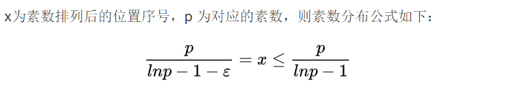

##进制转换
1.x%10 (当前位应该填的值)
2.x=x/10

字符串除法的实现，用纸上除法的方式。从最高位开始除并留余数。
substr()返回字串

从最高位开始，乘进制再加现在的数 

做的时候注意判断empty().进制转换0的转换不判断empty会错。

##最大公约数与最小公倍数
GCD, 辗转相除
LCM（least common multiple）,先求GCD, A*B/GCD

##质数
1.sqrt(n)遍历
2.筛，先创建比i小的筛判断i是否是素数，再用i扩充筛（32位筛只用到10001）
素数分布

##分解质因数
用10001筛+唯一一个大于sqrt(1e9)的素因数。

##快速幂
幂指数用2进制表示，前一项可由后一项的平方得到。

##矩阵和矩阵快速幂
二维数组模拟矩阵
快速幂思想类似，初始值是单位矩阵

##高精度整数
大整数类 模板

windows printf longlong 是"%I64d" linux 是"%lld"
bool isPrimes[MAXN] = {true}; //只会把第一个置位true全部置位要用循环
40000*40000 会乘法溢出错误
unsigned int 最大值 40e 4294967295
unsigned longlong 18,446,744,073,709,551,615
重载等号时return 左操作数的*this
